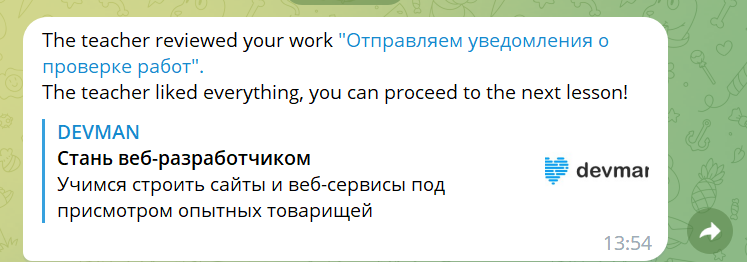

# Reviews notifications in Telegram

The program polls [dvmn.org/api](https://dvmn.org/api/docs/) and sends notifications about reviews via Telegram bot.



## Prerequisites

Python 3.11 is required.

## Installing

- Download the project files.
- It is recommended to use [venv](https://docs.python.org/3/library/venv.html?highlight=venv#module-venv) for project isolation.
- Set up packages:

```bash
pip install -r requirements.txt
```

- Go to [@BotFather](https://t.me/BotFather) and register your Telegram bot.

- **Note**: Bots can't initiate conversations with users. You must send a message to your bot first.

- Set up environmental variables in your operating system or in .env file. The variables are:
  - `DEVMAN_TOKEN` is your personal authorization token at [dvmn.org/api](https://dvmn.org/api/docs/);
  - `REVIEW_BOT_TOKEN` is your bot token from [@BotFather](https://t.me/BotFather);
  - `TELEGRAM_USER_ID` is your user token from [@userinfobot](https://telegram.me/userinfobot);
  - `REVIEW_REQUEST_TIMEOUT` is the timeout of the request to [dvmn.org/api](https://dvmn.org/api/docs/), optional, default: 60;
  - `DEBUG_MODE` turns the debug mode on or off, optional, default: False (off).

To set up variables in .env file, create it in the root directory of the project and fill it up like this:

```bash
DEVMAN_TOKEN=your_devman_token
REVIEW_BOT_TOKEN=your_bot_token
TELEGRAM_USER_ID=your_user_id
REVIEW_REQUEST_TIMEOUT=30
DEBUG_MODE=True
```

## Using the script

- Run:

```bash
python main.py
```

- The script polls [dvmn.org/api](https://dvmn.org/api/docs/), which uses [Long polling technology](https://dvmn.org/encyclopedia/about-chatbots/long-polling/). If you have completed reviews, you will get a message from your bot.

## Project goals

The project was created for educational purposes.
It's a lesson for python and web developers at [Devman](https://dvmn.org/).
